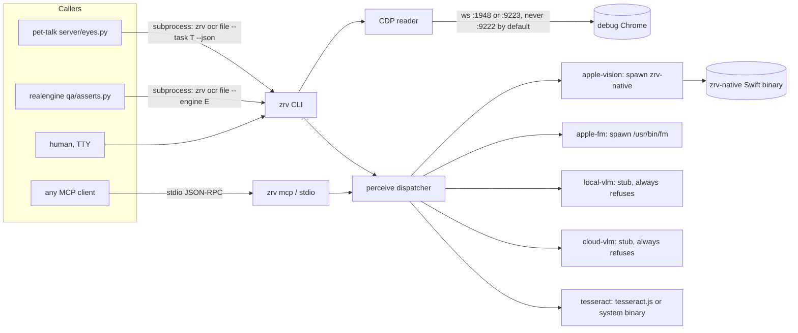

## Purpose

zero-vision reads a Chrome tab, an image, a PDF page, or a local video as
text, ranking cheap local engines first and never falling back to cloud
silently. It is consumed as a CLI (`zrv`) and an MCP server (`zrv mcp`) by
pet-talk, realengine, and MotionVector. It is not a browser driver: it never
clicks, types, or navigates without an explicit flag.

## System diagram



```text
zrv/zrv-mcp --+-- CDP reader --ws--> debug Chrome (:1948, :9223)
              |
              +-- perceive() --+-- apple-vision --spawn--> zrv-native (Swift)
                                +-- apple-fm     --spawn--> /usr/bin/fm
                                +-- local-vlm    --(stub, exits refused)
                                +-- cloud-vlm    --(stub, exits refused)
                                +-- tesseract    --spawn--> tesseract binary
                                                  --or--> tesseract.js (wasm)
Callers: pet-talk (server/eyes.py), realengine (qa/asserts.py), any MCP client
```

## Components

| Component | File/dir | Job | Interface it exposes |
| --- | --- | --- | --- |
| CLI entry | `src/cli.ts` | Parse argv, dispatch to CDP or `perceive()`, print text/JSON | `zrv`, `zrv ocr`, `zrv snap`, `zrv mcp` (argv) |
| MCP server | `src/mcp.ts` | stdio JSON-RPC wrapper over the same CDP + perceive calls | 5 tools, see Interfaces |
| Engine registry | `src/engines/index.ts` | `EngineId` type, `resolveEngine()`, `perceive()` dispatcher, config load | `perceive(engine, input): Promise<PerceptionResult>` |
| apple-vision engine | `src/engines/apple-vision.ts` | Spawns `zrv-native`, maps stdout JSON to `PerceptionResult` | in-process function |
| apple-fm engine | `src/engines/apple-fm.ts` | Spawns `/usr/bin/fm respond --image ... --tool ocr` | in-process function |
| local-vlm engine | `src/engines/local-vlm.ts` | Checks weights path, always returns `ok:false` (see Known gaps) | in-process function |
| cloud-vlm engine | `src/engines/cloud/index.ts` | Checks API key env, always returns `ok:false` (see Known gaps) | in-process function |
| tesseract engine | `src/engines/tesseract.ts` | System `tesseract` binary or `tesseract.js` wasm; ffmpeg for video | in-process function |
| Native binary resolver | `src/native.ts` | Locates `zrv-native`: `ZEROVISION_NATIVE`, installed package, dev build dirs | `nativeBin()`, `spawnNative()` |
| CDP client | `src/cdp/client.ts` | Raw WebSocket JSON-RPC to a Chrome debug target | `CdpClient` |
| CDP attach | `src/cdp/attach.ts` | Port probing, tab listing/picking, `Target.attachToTarget` | `attach()`, `findOpenPort()`, `listTabs()`, `pickTab()`, `probePorts()` |
| CDP extract | `src/cdp/extract.ts` | AX-tree walk to text/markdown/YAML, selector reads, opaque-region detection, screenshot capture, plain fetch | `extractPage()`, `extractSelector()`, `captureScreenshot()`, `fetchUrl()` |
| Snap | `src/snap.ts` | Wraps `/usr/sbin/screencapture` for interactive capture | `interactiveCapture()`, `runScreencapture()` |
| Native OCR binary | `native/Sources/zrv-native/main.swift` | Swift executable: Vision OCR on images/clipboard/video via AVFoundation | subcommands `ocr-image`, `ocr-clipboard`, `ocr-video` (JSON on stdout) |

## Interfaces

### CLI (`zrv`, verified against `zrv --help` on the installed binary at `~/.local/bin/zrv`)

| Command / flag | Shape | Consumer |
| --- | --- | --- |
| `zrv [--md\|--a11y] [--tab id] [--url u] [--engine e] [--json]` | Reads the attached/default Chrome tab. `--md` markdown, `--a11y` AX YAML, default cleaned text | humans, agents |
| `zrv --selector <css> [--tab id] [--url u]` | Text of one CSS-matched element only | humans, agents |
| `zrv --tabs [--port n]` | Lists attachable tabs, `id\ttitle\turl` per line | humans, agents |
| `zrv --url <u> [--navigate\|--fetch]` | `--navigate` opens/creates a tab and reads it; `--fetch` does a plain HTTP GET, no JS | humans, agents |
| `zrv --wait-ms N`, `zrv --wait-text GLOB`, `zrv --scroll` | Extraction timing/behavior flags, passed to `extractPage()` | humans, agents |
| `zrv --ocr-opaque` | If canvas/video coverage ≥30% of viewport, screenshots those regions and OCRs them with the current engine, appended under `--- opaque ocr ---` | humans, agents |
| `zrv ocr <file> [--engine e] [--task transcribe\|describe] [--lang L] [--level fast\|accurate]` | OCR/describe a local image or video file. Video detected by extension (`mp4`, `mov`, `m4v`, `webm`) | pet-talk, realengine, humans |
| `zrv ocr <file> [--mode scene\|interval\|all-idr] [--interval s] [--max-frames n]` | Video keyframe tuning, only meaningful when `file` is a video | pet-talk, realengine, humans |
| `zrv ocr --clipboard` | OCRs the current image clipboard | humans |
| `zrv ocr ... --json` | Emits one `PerceptionResult` JSON object on stdout instead of plain text | pet-talk, realengine |
| `zrv snap [--ocr] [--save path]` | Interactive `screencapture -i`; `--ocr` also OCRs and copies text to clipboard | humans only (needs TTY + GUI session) |
| `zrv mcp` | Starts the stdio MCP server (same process as `zrv-mcp` bin) | MCP clients |

Exit codes (from `src/cli.ts` `failCode()`): 0 ok; 1 usage or `cannot describe`; 2 input/path missing; 3 engine unavailable (weights/key/binary missing); 4 other engine failure. `zrv ocr --clipboard` without a following positional file does **not** call `usage()` — it runs and returns, unlike the spec's implied uniform usage() path; verified by reading `cli.ts`, not run live.

Note: `zrv --help` and `zrv ocr --help` print the identical generic usage block (verified live) — there is no per-subcommand help text.

### MCP (`zrv mcp`, stdio, SDK `@modelcontextprotocol/sdk`) — verified against `src/mcp.ts`

| Tool | Input shape | Output |
| --- | --- | --- |
| `peek_tabs` | `{ port?: number }` | `{ port, tabs: TabInfo[] }` as JSON text |
| `peek_page` | `{ targetId?, url?, format?: "text"\|"markdown", navigate?, fetch?, ocrOpaque?, waitMs?, waitText?, scroll?, selector?, port?, engine? }` | `{ title, url, text, opaque }` (or `{title,url,text}` when `selector` given) |
| `peek_a11y` | `{ targetId?, url?, navigate?, port?, verbose?, engine? }` | Raw AX YAML text |
| `ocr_image` | exactly one of `path` \| `base64` \| `clipboard`, plus `engine?, task?, level?, lang?` | Full `PerceptionResult` JSON |
| `ocr_video` | `path` (required), `mode?, interval?, maxFrames?, engine?, task?, level?, lang?` | Full `PerceptionResult` JSON |

`engine` enum accepted by tool schemas: `apple-vision`, `apple-fm`, `local-vlm`, `cloud-vlm`, `tesseract` (`peek_a11y`'s schema loosely types `engine` as any string, verified by reading `src/mcp.ts`).

### `PerceptionResult` JSON shape (`src/engines/index.ts`, shared by CLI `--json` and every MCP tool)

```ts
{
  ok: boolean;
  engine: "apple-vision" | "apple-fm" | "local-vlm" | "cloud-vlm" | "tesseract";
  task: "transcribe" | "describe";
  text: string;
  blocks?: { text, confidence?, bbox? }[];
  transcript?: { t: number, text: string }[];  // video only
  ms: number;
  tokens?: { input, output };
  costUsd?: number;
  model?: string;
  error?: string;
}
```

### Engine ids and selection

Not an engine: **Chrome AX / CDP text** is the default producer for tab reads (`zrv` with no `ocr`/`snap`/`mcp` subcommand). It is always local, never routed through `perceive()`, and has no `EngineId` value — README and `docs-agent/llms.txt` list it first in the "rank" alongside the five real engine ids, which reads as one list of six choices but is actually one producer (CDP) plus five pixel engines.

`resolveEngine()` order: `--engine` flag → `ZEROVISION_ENGINE` env → `~/.config/zero-vision/config.json` `engine` field → platform default (`tesseract` on Linux and on Intel/x64 Mac, else `apple-vision`).

| Engine id | Chosen when | Verified behavior |
| --- | --- | --- |
| `apple-vision` | Default on Apple-silicon macOS | Spawns `zrv-native ocr-image\|ocr-clipboard\|ocr-video`. `capabilities: ["transcribe"]` only — rejects `task: describe` with `engine apple-vision cannot describe; use apple-fm, local-vlm, or cloud-vlm` |
| `apple-fm` | Named explicitly (`--engine apple-fm`) | Shells to `/usr/bin/fm respond --image <path> --text <prompt> --tool ocr --no-stream`. Refuses video and clipboard inputs. Measured 2026-09-12: ~102s for `describe` on one 2280×600 PNG (pet-talk `EyesConfig` docstring) |
| `local-vlm` | Named explicitly | **Always returns `ok:false`** in this build, even when the MLX weights exist on disk at the default path. Checked in via `src/engines/local-vlm.ts`: it is "wired for presence-check only," gated behind an unshipped `ZEROVISION_LIVE_VLM=1` |
| `cloud-vlm` | Named explicitly | **Always returns `ok:false`** in this build. Checks the API key env var (default `GEMINI_API_KEY`) and the 10MB size cap, then refuses with "provider HTTP is not called in v1" — no provider SDK is wired yet |
| `tesseract` | Default on Linux and Intel/x64 macOS | System `tesseract` binary (TSV output, word-level blocks) if on PATH, else `tesseract.js` wasm. Video via `ffmpeg` keyframe extraction, both fail-closed if missing. `capabilities: ["transcribe"]` only |

### Cross-product edges (see below), MCP tools, engine ids above are the full external contract surface as of this commit.

## Data & state

- No database, no persistent daemon. Every CLI/MCP call is stateless per invocation.
- Config file `~/.config/zero-vision/config.json` (optional): `engine` default, `engines["local-vlm"].modelPath`, `engines["cloud-vlm"].{provider,model,apiKeyEnv,baseUrl}`. Never holds API key values — those are env-only (`apiKeyEnv` names the variable, `loadConfig()`/`cloud-vlm` never reads a key from this file).
- Temp files: `mkdtempSync` under the OS tmp dir for byte inputs (image bytes, clipboard grabs, video frame extraction), removed in a `finally`/at the end of the call. `apple-vision`, `tesseract`, and MCP `ocr_image` base64 all follow this pattern.
- Nothing is cached between calls. `local-vlm`'s weights path and `cloud-vlm`'s key are re-checked every call.
- Never persisted or logged: image bytes, page text to files (per spec §13; verified only for the base64/clipboard temp-file lifecycle, not for an exhaustive absence of any stderr echo).

## Cross-product edges

| Other product | Direction | Mechanism | Contract file |
| --- | --- | --- | --- |
| pet-talk | pet-talk → zero-vision | Subprocess: `zrv ocr <path> --task <transcribe\|describe> [--engine <pin>] --json`, parses the `PerceptionResult` JSON from stdout | `pet-talk/server/eyes.py` (class doc names verified flags "2026-09-12"); `EYES_TIMEOUT_S` defaults to 8.0s, far below the ~102s measured `apple-fm describe` latency, so a describe call through pet-talk with the default timeout is expected to time out — unverified whether pet-talk raises this timeout for `apple-fm` specifically |
| realengine | realengine → zero-vision | Subprocess: `zrv ocr <png> --engine <ZERO_VISION_ENGINE, default "tesseract">`, plain-text stdout (no `--json`), used by `labels_present()` in its QA gate | `realengine/qa/asserts.py` |
| MotionVector | none confirmed in this pass | README lists MotionVector/`mvec` as a consumer for contact sheets and title cards after `mvec frame` | not verified — no grep run against the motionvector repo in this pass |

## Invariants

1. Never attach to Chrome debug port 9222 by default — enforced in `src/cdp/attach.ts` `probePorts()`, only added when `ZEROVISION_ALLOW_USER_CHROME=1`.
2. Never navigate an existing tab — `--url` without `--navigate` only reads; `--navigate` opens a new tab or reuses an exact match, never redirects one. Enforced in `attach()`.
3. `cloud-vlm` never runs without its API key env var set, and never sends bytes over 10MB. Enforced in `src/engines/cloud/index.ts`. Unenforced beyond that: it currently never sends bytes at all (stubbed).
4. `apple-vision` and `tesseract` refuse `task: describe` rather than guessing. Enforced in `perceive()` (apple-vision) and `tesseract.ts` (self-check).
5. Byte inputs are capped at 30MB (`apple-vision`, `tesseract`) and 10MB (`cloud-vlm`). Enforced per-engine, not centrally — a new engine must repeat this check itself; no shared guard in `perceive()`.
6. Contact sheets are one image, never split into a grid. Unenforced in code — there is no grid-splitting code path to disable; this is a design absence, not a runtime check.

## Known gaps

- 2026-09-12: `local-vlm` and `cloud-vlm` never actually run inference. Both are permanently `ok:false` stubs regardless of weights/key presence — README, SKILL.md, and `docs-agent/llms.txt` describe them as working opt-in engines without flagging this.
- 2026-09-12: pet-talk's default 8s OCR timeout (`EYES_TIMEOUT_S`) is far shorter than the measured ~102s `apple-fm describe` latency on one 2280×600 PNG — a describe call is expected to time out unless a caller raises the timeout. Not verified whether pet-talk does this per-engine.
- 2026-09-11 (from the adoption audit on `adopt/review-pile`, `adopt/agent-readiness-report.md`): `package.json` `files[]` excludes `docs-agent/`, so npm installs never ship `llms.txt`/`llms-full.txt`/the manifest. README has no link to `docs-agent/llms.txt`. `docs-agent/llms-full.txt` has zero markdown links in its source list. GitHub repo topics are empty and `homepage` is null.
- 2026-09-12: `apple-fm` refuses clipboard and video input; only `apple-vision` and `tesseract` support video OCR.
- 2026-09-12: README's engine-rank list and `docs-agent/llms.txt`'s engine-rank list both present "Chrome AX / cleaned text" as item 1 of the same numbered list as the five real `EngineId` values, which is not how the code models it (CDP is a separate producer, not selectable via `--engine`).
- 2026-09-11 (spec §17, "Not confirmed", still true by inspection): end-to-end `apple-vision` latency, `local-vlm` tok/s, whether `fm respond --tool ocr` returns structured blocks, `/json/list` ordering under Chrome 144+, and current cloud pricing are all unverified in this pass too.

## Changelog

| Version | Date | Change | Commit |
| --- | --- | --- | --- |
| 0.1.2 | 2026-09-11 | `--selector` reads, CLI/MCP flag parity (lang/level/port/scroll/waitText/navigate/video tuning), examples, bin-path fix, release workflow fix | (see `CHANGELOG.md`) |
| 0.1.1 | 2026-09-10 | Corrected release notes attribution | (see `CHANGELOG.md`) |
| 0.1.0 | 2026-09-10 | First release: CLI, MCP server, 5 engines (`apple-vision` default, `apple-fm`, `local-vlm`, `cloud-vlm` fail-closed, `tesseract` for Linux/Intel) | (see `CHANGELOG.md`) |
| 1.0.0 (this doc) | 2026-09-12 | `docs/ARCHITECTURE.md` and `docs/ROADMAP.md` authored, first living-docs pass | this branch |
